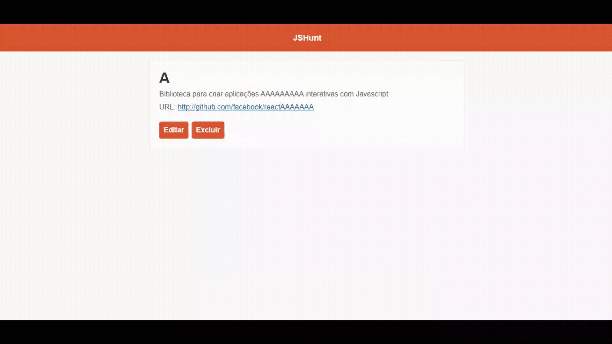

# Huntweb ReactJS

Front-End Web application inspired by Product Hunt made with React.js.

The purpose of this application is to practice the concepts of React.js as seen in the [Rocketseat](https://rocketseat.com.br/) free course.

## Runing it localy

### API

To run this project you need to set up its API (Get the [Back-End](https://github.com/GabrielPeresBernes/Huntweb-NodeJS))

### NPM / Yarn

Inside the project root directory run `npm install` or `yarn install` to install the project dependencies

Finally you can run `npm start` or `yarn start` to start the application

## Functionality

- **List all resources**

- **Create a new resource**

- **Show and Edit a resource**

- **Show and Delete a resource**

## Directory Structure

- **node_modules/** (project dependencies)

- **public/** (public files like index.html and favicon)

- **src/** (main application files, available in development)

  - **components/** (components React)

  - **pages/** (application pages)
  
  - **services/** (handles external resources, like api interface)

  - **utils/** (utility functions)

  - **App.js** (import the application routes to be rendered)

  - **index.js** (render React in the application)

  - **routes.js** (routes of the application)
  
  - **styles.css** (main styles of the application)
